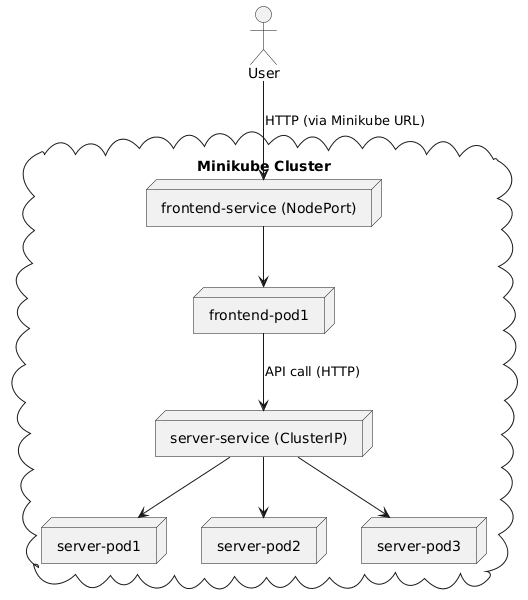

# 01-Fullstack Kubernetes Example

This project demonstrates a simple fullstack application deployed on Kubernetes using Minikube. It includes a React frontend and a Node.js backend, with all necessary Kubernetes manifests for local development and deployment.


## How It Works

### Architecture Overview



- **Frontend**: A React app built with Vite, served via Nginx in production.
- **Backend**: A Node.js Express server providing API endpoints.
- **Kubernetes**: Both frontend and backend are containerized and deployed as separate Deployments and Services in a local Minikube cluster.

### Flow of Requests
1. **User** accesses the frontend via a URL exposed by Minikube (`minikube service k8s-frontend --url`).
2. **Frontend Service** receives the HTTP request and routes it to a frontend Pod.
3. **Frontend Pod** (React app) may call the backend API for data.
4. **Backend Service** receives the API call and routes it to a backend Pod.
5. **Backend Pod** (Node.js server) processes the request and responds.


## Why This Setup?

- **Separation of Concerns**: Frontend and backend are developed, built, and deployed independently, making the stack modular and maintainable.
- **Kubernetes Native**: Using Deployments and Services is the standard way to run scalable, resilient apps in Kubernetes.
- **Minikube**: Chosen for local development because it simulates a real Kubernetes cluster on your machine, making it easy to test and learn.
- **Dockerized Apps**: Ensures consistency between local, test, and production environments.
- **Service Abstraction**: Kubernetes Services provide stable endpoints and load balancing for pods, abstracting away pod IP changes.
- **Load Balancing**: We use Kubernetes Services (specifically, ClusterIP and NodePort) to automatically distribute incoming traffic across all healthy pods. This ensures high availability and scalability—if one pod fails or more pods are added, the service will balance requests among them.


## Kubernetes Networking Options

Kubernetes provides several ways to expose and connect your applications:

- **ClusterIP** (default):
  - Exposes the service on an internal IP in the cluster.
  - Only accessible within the cluster.
  - Used for backend services that only other pods need to access.

- **NodePort**:
  - Exposes the service on a static port on each node’s IP.
  - Makes the service accessible from outside the cluster (e.g., via Minikube or a cloud provider).
  - Used here for the frontend so you can access it from your browser.

- **LoadBalancer**:
  - Provisions an external load balancer (in supported cloud environments).
  - Used for production deployments to expose services to the internet.

- **ExternalName**:
  - Maps a service to a DNS name (external to the cluster).
  - Useful for integrating with external services.

- **Ingress**:
  - Manages external access to services, typically HTTP.
  - Provides advanced routing, SSL termination, and virtual hosting.


## Key Decisions

- **Separate Deployments & Services**: Each app (frontend, backend) has its own Deployment and Service, allowing independent scaling, updates, and management.
- **Kubernetes Load Balancing**: Both frontend and backend Services provide built-in load balancing, automatically distributing traffic across all healthy pods. This ensures high availability and resilience.
- **NodePort Service for Frontend**: The frontend is exposed to your host via a NodePort, making it accessible in your browser through Minikube.
- **ClusterIP Service for Backend**: The backend is only accessible within the cluster, improving security and reducing external attack surface.
- **Zero-Downtime Rollouts**: Using `kubectl rollout restart deployment ...` enables seamless updates to deployments without downtime.
- **Minimal, Readable Manifests**: All Kubernetes YAML files are kept simple and well-commented for learning and clarity.


## How to Use

1. **Start Minikube**
   ```bash
   minikube start
   ```
2. **Point Docker to Minikube**
   ```bash
   eval $(minikube docker-env)
   ```
3. **Build Images**
   ```bash
   cd frontend && docker build -t k8s-frontend .
   cd ../server && docker build -t k8s-server .
   ```
4. **Apply Kubernetes Manifests**
   ```bash
   cd ../infra
   kubectl apply -f frontend-depl.yaml
   kubectl apply -f frontend-svc.yaml
   kubectl apply -f server-depl.yaml
   kubectl apply -f server-svc.yaml
   ```
5. **Access the App**
   ```bash
   minikube service k8s-frontend --url
   ```
6. **Rollout/Restart Deployments**
   ```bash
   kubectl rollout restart deployment k8s-frontend
   kubectl rollout restart deployment k8s-server
   ```


## Further Reading
- See the `frontend/`, `server/`, and `infra/` folders for more details and specific instructions.
- For visual diagrams, see the PlantUML examples in project documentation or ask for more!